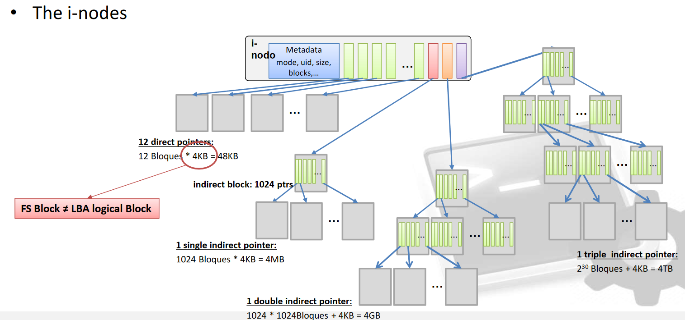
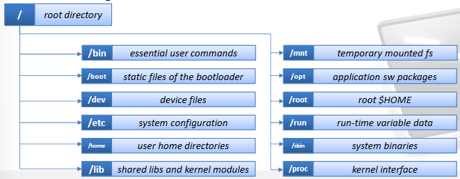
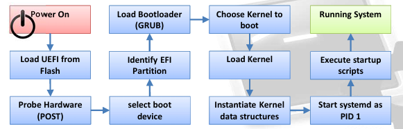

<!DOCTYPE html>
<html>
<head>
    <title>Documento Markdown con Imagen de Cabecera</title>
    <style>
        img {
            width: 100%;
            height: auto;
        }
    </style>
</head>
<body>

<!-- Cabecera con imagen -->


# Índice

- [Tema 1: Advanced Shell](#tema-1-advanced-shell)
- [Tema 2: Sistemas de Ficheros](#tema-2-sistemas-de-ficheros)
- [Tema 3: Gestión de Usuarios](#tema-3-gestión-de-usuarios)
- [Tema 4: Gestión de Software](#tema-4-gestión-de-software)
- [Tema 5: Red](#tema-5-red)
- [Tema 6: Arranque y Parada](#tema-6-arranque-y-parada)
- [Tema 7: Sistemas de Ficheros Avanzado](#tema-7-sistemas-de-ficheros-avanzado)
- [Tema 8: Recursos y Eventos](#tema-8-recursos-y-eventos)

---

# Tema 1: Advanced Shell

## Teoría

Fundamentos de la shell, manipulación de strings, variables de entorno y shell scripting. Son los conceptos básicos de la shell de Linux, se ve mejor en la práctica.

## Practica 1

- **Ejercicio 1**
    Utilizar el manual (comando man)
    En este ejercicio nos piden que utilicemos funciones basicas del comando **man**, buscar palabras, movernos, ir a una línea concreta...
    [Utilización del comando man](https://www.man7.org/linux/man-pages/man1/man.1.html)

- **Ejercicio 2**
    En este ejercicio nos piden utilizar una serie de comandos básicos para gestionar archivos, permisos...

    1. Crear un directorio llamado "SI" dentro del directorio de usuario y obtener su ruta absoluta:

    ```bash
    mkdir $HOME/SI
    cd $HOME/SI
    pwd
    ```

    2. Utilizar el comando "timedatectl" para obtener información sobre la fecha y hora del sistema, y redirigir su salida a un archivo de texto:
    
    ```bash
    timedatectl > tiempo.txt
    ```

    3. Crear dos archivos en el directorio de usuario, "file1" y "file2", redirigiendo la salida de los comandos "timedatectl" y "date" a ellos, respectivamente:

    ```bash
    timedatectl > $HOME/file1
    date > $HOME/file2
    ```

    4. Combinar el contenido de "file1" y "file2" en tres archivos nuevos llamados "file3", "file4" y "file5":

    ```bash
    cat $HOME/file1 $HOME/file2 | tee $HOME/file3 $HOME/file4 $HOME/file5
    ```

    5. Crear un alias permanente para el comando "ls" que muestre la lista de archivos en formato extendido, incluyendo archivos ocultos, ordenados de manera ascendente por fecha de modificación:

    ```
    echo "alias lc='ls -lAt'" >> $HOME/.bashrc
    source $HOME/.bashrc
    ```

    6. Listar los 5 archivos más recientes (modificados recientemente) en el directorio "/etc":

    ```
    ls -lt | head -n 5 /etc
    ```

    7. Encontrar el archivo más reciente dentro del directorio "/var" y sus subdirectorios:

    ```bash
    find /var -type f -printf '%T+ %p\n' | sort -r | head -n 1
    ```

    8. Cambiar los permisos de un archivo para que solo el usuario pueda accederlo en modo de lectura y escritura:

    ```bash
    chmod 600 archivo
    ```

    9. Restringir el acceso de otros usuarios al directorio personal:

    ```bash
    chmod 700 $HOME
    ```
    10. Determinar la cantidad de usuarios en el sistema y verificar cuál es el propio:

    ```bash
    who
    ```

    11. Verificar cuándo fue la última vez que se accedió al sistema y desde dónde:

    ```bash
    last
    ```
- **Ejercicio 3**
    En este ejercicio nos piden hacer distintas tareas usando el editor de texto "vim". Este es bastante útil para hacer muchas cosas de forma muy rápida, sin embargo es bastante complejo. Nano es más sencillo de usar para cuestiones más triviales. De todos modos adjunto a continuación una página que explica mejor el uso de vim por si fuera necesario.
    [*Ayuda Vim*](https://vim.dantecalderon.com/lang/es_es/)

- **Ejercicio 4**
    De nuevo, tareas básicas de la shell.

    1. Comprimir el directorio /var en un archivo .tar.gz y colocarlo en tu $HOME. Luego, verificar la correcta compresión descomprimiéndolo en /tmp:

    Solución:
    ```bash
    tar -czf $HOME/var_backup.tar.gz /var

    tar -xzf $HOME/var_backup.tar.gz -C /tmp
    ```
    Significado de los parámetros de tar:
    - c: Crea un nuevo archivo tar.
    - z: Utiliza gzip para comprimir el archivo.
    - f: Especifica el nombre del archivo.
    - x: Extrae el contenido del archivo.

    2. Como superusuario (root), buscar todos los archivos regulares propiedad del usuario 'alumno' en el sistema (/) y listarlos en formato extendido en un solo comando:

    ```bash
    sudo find / -type f -user alumno -exec ls -l {} +
    ```

    3. Como superusuario (root), mostrar las últimas 30 líneas del archivo /var/log/syslog:

    ```bash
    sudo tail -n 30 /var/log/syslog
    ```

- **Ejercicio 5**
    Uso de comandos más avanzados (awk, sed, sort)

    1. Listar el contenido del directorio /etc en formato extendido y redirigir la salida a un archivo llamado contetc.txt:
    ```bash
    ls -l /etc > contetc.txt
    ```

    2. Realizar las siguientes tareas:
        Crear una versión reducida del archivo contetc.txt, conteniendo la siguiente información para cada línea.
        ```bash
        awk '{print $9, $5, $3}' contetc.txt > reduced_contetc.txt
        ```
        Ordenar el contenido del nuevo archivo reduced_contetc.txt por el nombre de archivo y escribir el resultado en alphasorted.txt, y luego en antialphasorted.txt en orden inverso
        ```bash
        sort -k1,1 reduced_contetc.txt > alphasorted.txt
        sort -k1,1 -r reduced_contetc.txt > antialphasorted.txt
        ```
        Ordenar el contenido del nuevo archivo reduced_contetc.txt por el tamaño y escribir el resultado en numsorted.txt
        ```bash
        sort -n -k2 reduced_contetc.txt > numsorted.txt
        ```
        Crear un nuevo archivo conteniendo los tres primeros caracteres de cada nombre de archivo o directorio
        ```bash
        cut -c1-3 reduced_contetc.txt > first_three_chars.txt
        ```

        Ahora sobre otro archivo, se nos pide realizar otra serie de tareas.
        Eliminar líneas con &lt;article&gt; y &lt;/article&gt;
        ```
        sed -i '/<article>/d; /<\/article>/d' archivo.txt
        ```

        Reemplazar &lt;title&gt; con "Title:" y &lt;/title&gt; con nada
        ```
        sed -i 's/<title>/Title:/g; s/<\/title>//g' archivo.txt
        ```

        Reemplazar todas las etiquetas &lt;para&gt; y &lt;/para&gt; con una cadena vacía y eliminar la línea si queda vacía
        ```
        sed -i 's/<para>//g; s/<\/para>//g' archivo.txt
        sed -i '/^$/d' archivo.txt
        ```

        Reemplazar todas las etiquetas &lt;emphasis&gt; y &lt;/emphasis&gt; con asteriscos
        ```
        sed -i 's/<emphasis>/\*/g; s/<\/emphasis>/\*/g' archivo.txt 
        ```

        Reemplazar la palabra "web" por "Web" en todo el archivo
        ```
        sed -i 's/web/Web/g' archivo.txt
        ```
        Reemplazar las líneas que comienzan con &lt;/listing&gt; por "---begin listing"
        ```
        sed -i 's/^<\/listing>/---end listing/g' archivo.txt
        ```
- **Ejercicio 6**
    En este ejercicio se nos pide hacer uso del comando **grep** para buscar cadenas de texto en un archivo. Grep utiliza expresiones regulares para buscar coincidencias en los textos. Es importante recordad como se escriben las expresiones regulares. A continuación un par de páginas de referencia:
    [*sintaxis de las expresiones regulares*](https://developer.mozilla.org/es/docs/Web/JavaScript/Guide/Regular_Expressions/Cheatsheet)
    [*testear expresiones regulares*](https://regex101.com/)

- **Ejercicio 7**
    Shell Scripting
    Escribir una serie de scripts que realicen distintas operaciones.


## Cheatsheet

- Enlaces de referencia para entender mejor algunos comandos:

    * [*man*](https://www.man7.org/linux/man-pages/man1/man.1.html)
    * [*ls*](https://man7.org/linux/man-pages/man1/ls.1.html)
    * [*tee*](https://man7.org/linux/man-pages/man1/tee.1.html)
    * [*cat*](https://man7.org/linux/man-pages/man1/cat.1.html)
    * [*alias*](https://man7.org/linux/man-pages/man1/alias.1p.html)
    * [*find*](https://man7.org/linux/man-pages/man1/find.1.html)
    * [*chmod*](https://man7.org/linux/man-pages/man2/chmod.2.html)
    * [*last*](https://man7.org/linux/man-pages/man1/last.1.html)
    * [*who*](https://man7.org/linux/man-pages/man1/who.1.html)
    * [*awk*](https://www.man7.org/linux/man-pages/man1/awk.1p.html)
    * [*sort*](https://man7.org/linux/man-pages/man1/sort.1.html)
    * [*sed*](https://man7.org/linux/man-pages/man1/sed.1.html)
    * [*cut*](https://man7.org/linux/man-pages/man1/cut.1.html)
    * [*grep*](https://man7.org/linux/man-pages/man1/grep.1.html)
    * [*type*](https://man7.org/linux/man-pages/man1/type.1p.html)

    Se han omitido comandos basicos como cd, mkdir, pwd... Para cualquier duda con algún comando consultar la página:
    [*linux man pages*](https://man7.org/linux/man-pages/index.html)


# Tema 2: Sistemas de Ficheros

## Teoría
### Introducción
Un sistema de ficheros es un mecanismo para organizar y representar el almacenamiento del sistema.
Un disco de almacenamiento tiene típicamente 3 partes:
- MBR: Es el primer sector y tiene una tabla de particiones y un código de arranque (bootloader) que se carga en memoria y se ejecuta al encender el sistema.
- GPT: Tiene una cabecera y tabla de particiones.
- Particiones: Sección en la que se almacenan los datos.

Un sistema de ficheros consta de varias partes:
- Dispositivo de almacenamiento. Es el hardware en sí, un SSD, HDD...
- Partición. Permite que un único almacenamiento físico se comporte como varios sistemas de ficheros (uno por partición).
- Sistema de ficheros. Actua como mediador entre los bloques de datos del disco y la interfaz de los programas. Sirve para acceder y manipular archivos. Este sistema tiene tres componentes principales:
    - Superbloque(superblock): contiene información sobre el sistema de ficheros.
    - Estructura del FS(FS structure): define cómo se organizan carpetas y archivos.
    - Datos (raw data): es la información real guardada en el disco.

### Sistema de ficheros EXT
Linux implementó los sistemas de ficheros EXT, que con el tiempo han ido evolucionando a nuevas versiones.
Un **i-nodo** es el bloque básico sobre el que se construye el sistema de ficheros. Almacena metadatos y los datos en sí. Cada fichero o directorio tiene uno asociado y por defecto, consumen un 10% del almacenamiento. Los i-nodos contienen punteros para direccionar los datos en la memoria. Inicialmente se usaban punteros directos pero para poder direccionar más memoria se estableció una jerarquía de punteros. Dependiendo de su posición en la jerarquía tendremos:
- Punteros directos
- Punteros de una indirección
- Punteros de doble indirección
- Punteros de triple indirección



¿Cómo es la FS structure de un sistema EXT? Tiene varias partes:
- Bitmap de i-nodos: Es un mapa de bits que indica cuales están ocupados o libres
- Bitmap de bloques: Indica que bloques están ocupados o libres.
- Tabla de i-nodos: cada entrada es un único i-nodo.
Si el bitmap de i-nodos no encuentra un hueco libre no podré crear nuevos ficheros. De hecho, si creamos muchos ficheros aunque estén vacíos, podríamos agotar el número de i-nodos y quedarnos sin poder crear nuevos archivos, aunque técnicamente habría espacio de sobra.
Del mismo modo, no tener huecos en el bitmap de bloques no me permitiría crear archivos. Esto podría darse si tenemos archivos muy grandes, que toman muchos bloques. Me quedarían i-nodos para asignar, pero no bloques.

Como mencionamos antes, EXT ha ido evolucionando en otras versiones. Veamos que cambios se han dado:
- Ext1: fue la primera versión, la asignación de espacio se realiza mediante bloques individuales, cada bloque puede contener una parte del archivo y se utilizan punteros para acceder a los bloques.
- Ext2: es la segunda versión, mantiene el funcionamiento del anterior pero viene para resolver un problema, la fragmentación. Los i-nodos y sus datos asociados podían estar muy lejos. Se mejoró la localidad de los datos y metadatos.
- Ext3: añade sobre Ext2 el **journaling** para mayor confiabilidad y recuperación de datos.
- Ext4: se introdujo el uso de los **extents**. Mejoró la eficacia del istema de archivos al permitir la asignación de rangos continuos de bloques para un archivo. Mejora el rendimiento de acceso a archivos grandes reduciendo la fragmentación externa.

- **Journaling**: También conocido como registro de transacciones, garantiza la integridad y consistencia de los datos llevando un registro de las operaciones para poder restablecerlas en caso de fallo del sistema. Antes de realizar las transacciones se registran en el journal. En caso de fallo, durante el reinicio, el sistema consulta el journal y vuelve a un estado coherente.
    - ¿Qué pasa si la escritura del journal es interrumpida? El sistema de ficheros permanece consistente pero no se ejecuta la transacción.
    - ¿Qué pasa si el journal es escrito correctamente pero los datos en el disco no? El sistema de ficheros permanece inconsistente temporalmente y durante el proceso de encendido se reestablecen los journals que no estén completos.

- **Extent**:  Representa un bloque contiguo de espacio en disco asignado a un archivo. En lugar de  utilizar una lista de bloques individuales para almacenar un archivo, un extent permite almacenar una secuencia  continua de bloques de datos.el uso de extents reduce la sobrecarga de almacenamiento y mejora la eficiencia del espacio en disco. En lugar de mantener un puntero individual para cada bloque de datos, solo se necesita un puntero para cada extent, lo que ahorra espacio en la estructura del sistema de archivos y acelera la navegación y manipulación de archivos grandes. Por otra parte, los extents pueden producir fragmentación interna.

### Sistema de ficheros raíz
Algunos conceptos a definir:

- El sistema de ficheros raíz es imprescindible que este disponible en arranque, ya que es el principal directorio sobre el cual acceder a todos los demás. 


- Enlace de tipo duro: Un nuevo fichero que apunta al mismo i-nodo. Si borro el fichero original sigo teniendo acceso al contenido original por el enlace duro que cree antes, manteniendo vivo el i-nodo. 
- Enlace de tipo blando: redireccion, una especie de alias con el path para apuntar al fichero directamente, si borro el fichero el i-nodo se borra no seguiría teniendo el contenido.  
- Una "Access Control List" (FYI), en español "Lista de Control de Acceso", es un mecanismo utilizado en sistemas operativos y sistemas de archivos para controlar y gestionar los permisos de acceso a recursos, como archivos, directorios o dispositivos. Es una lista asociada a un recurso que especifica los usuarios, grupos u otros sujetos y los permisos que tienen sobre ese recurso. Cada entrada en la lista de control de acceso contiene información sobre el sujeto y los permisos que 
se le otorgan, como leer, escribir, ejecutar o modificar. 
- Si tengo un fichero con el atributo "i" que significa que no se puede borrar, tendria que cambiarle el atributo con los comandos **Isattr** y **chattr** a otro distinto para que pudiese ser borrado. 

- El nombramiento de las unidades de almacenamiento será a partir de "sd[letra]", por ejemplo sda. Las particiones se hacen con números tal que tengamos "sda1", "sda2"... Es importante mantener la consistencia en el nombramiento y cada una es única y se identifica con su UUID.

- El sistema operativo puede montar varias particiones con diferentes sistemas de ficheros, por esto en linux existe una interfaz llamada VFS.Es una capa de abstracción que permite que los programas interactúen con los archivos y directorios independientemente del sistema de archivos subyacente en el que estén almacenados. El VFS proporciona una interfaz común para acceder a diferentes tipos de sistemas de archivos, ya sean locales o remotos, lo que facilita el desarrollo de aplicaciones portables y compatibles con una variedad de sistemas de almacenamiento. 

### Encriptación
Linux tiene un sistema de cifrado para particiones completas o dispositivos de almacenamiento llamado **LUKS (linux Unified Key Setup)**. Es un sistema de cifrado de disco que proporciona una capa de cifrado a nivel de bloque para proteger el contenido de las particiones o dispositivos. Los datos se cifran y descifran automáticamente a medida que se leen y escriben en el disco. El cifrado se basa en el uso de una o más claves de cifrado y están protegidas mediante una contraseña o frase de paso. LUKS también admite el uso de claves de cifrado adicionales como tarjetas o tokens USB. LUKS encripta mediante el mecanismo AES, realiza una encriptación simétrica, significa que hay una única clave que es la que se usa para encriptar y desencriptar (master key).
**dm-crypt** es un driver que escribe encriptado el contenido que introduces en una partición, este driver necesitará entonces, tener acceso a la master key. Esta se encuentra en el LUKS header y solo se puede acceder con permisos de administrador. Por lo tanto, al conocer su ubicación, técnicamente podría conseguir la estructura del luks con el comando dd y robar la llave.
Si se pierden los datos de la cabecera, se pierden todos los datos del fichero encriptado ya que no se podría descifrar al no tener la llave.
La cabecera del LUKS está formada por:
- Encabezado binario: firma para detectar los dispositivos LUKS, información básica, tamaño del encabezado y suma de verificación de metadatos.
- Metadatos LUKS
    - keyslots: describen las áreas de almacenamiento de claves cifradas. Se pueden definir multiples contraseñas para un único disco cifrado.
    - digest: texto utilizado para verificar que las claves descifradas de los slots sean correctas.
    - segmentos: describen áreas en el disco que contienen datos cifrados.
- Metadatos secundarios: copias de seguridad para evitar la corrupción de datos en el encabezado.
- Keyslots: 


### Comandos

- e2fsprogs: Este es un conjunto de programas para crear, verificar y manipular sistemas de archivos ext2, ext3 y ext4 en Linux. Contiene herramientas como mkfs, tune2fs, resize2fs, entre otras.[e2fsorigs](http://www.escomposlinux.org/lfs-es/lfs-es-6.3/chapter06/e2fsprogs.html)

- dumpe2fs: Este comando se utiliza para mostrar información detallada sobre un sistema de archivos ext2, ext3 o ext4, incluyendo parámetros como tamaño de bloque, cantidad de inodos, UUID, entre otros. [dumpe2fs](https://www.golinuxcloud.com/dumpe2fs-command-in-linux/)

- debugfs dump: debugfs es una herramienta de depuración para sistemas de archivos ext2, ext3 y ext4. debugfs dump se utiliza para realizar un volcado de información del sistema de archivos.[debugfs](https://ngelinux.com/what-is-debugfs-in-linux-and-how-to-use-this-command/)

- lsattr: Muestra los atributos extendidos de los archivos en sistemas de archivos ext2, ext3 y ext4.[lsattr](https://howtoforge.es/tutorial-del-comando-lsattr-de-linux-para-principiantes-con-ejemplos/)

- chattr: Se utiliza para cambiar los atributos extendidos de los archivos en sistemas de archivos ext2, ext3 y ext4. Por ejemplo, puedes utilizarlo para hacer que un archivo sea inmutable o para establecer otros atributos especiales.[chattr](https://howtoforge.es/tutorial-de-comandos-chattr-de-linux-para-principiantes-5-ejemplos/)

- lsblk: Muestra información sobre los dispositivos de bloque (como discos duros y unidades USB) y sus relaciones de almacenamiento en el sistema.

- gdisk: Es una herramienta para particionar discos usando el esquema de particionado GPT (GUID Partition Table). Es una alternativa a la herramienta fdisk para discos grandes (>2 TB) y en sistemas EFI.
[gdisk](https://es.linux-console.net/?p=10509)

- mkfs: Este comando se utiliza para crear sistemas de archivos en dispositivos de bloque. Por ejemplo, puedes usar mkfs.ext4 para crear un sistema de archivos ext4 en una partición.[mkfs](https://es.linux-console.net/?p=19966)

- umount: Se utiliza para desmontar sistemas de archivos montados previamente con el comando mount.

- mount: Se utiliza para montar sistemas de archivos en el árbol de directorios del sistema. Por ejemplo, puedes usar mount /dev/sdb1 /mnt para montar la partición /dev/sdb1 en el directorio /mnt.[mount y umount](https://linuxize.com/post/how-to-mount-and-unmount-file-systems-in-linux/)

- df: Muestra el espacio utilizado y disponible en los sistemas de archivos montados en el sistema.[df](https://es.linux-console.net/?p=20080)

- dd: Se utiliza para copiar y convertir archivos, con opciones para leer y escribir bloques de datos a nivel de dispositivo.[dd](https://blog.desdelinux.net/guia-completa-y-detallada-con-ejemplos-de-dd/)

- fuser: Muestra los procesos que están utilizando un archivo o un sistema de archivos.[fuser](https://es.linux-console.net/?p=1579)

- lsof: Lista los archivos que están siendo utilizados por procesos activos en el sistema.

- fsck: Se utiliza para verificar y reparar sistemas de archivos. Puede utilizarse para detectar y corregir errores en sistemas de archivos dañados.[fsck](https://es.linux-console.net/?p=19953)

- tune2fs: Permite ajustar los parámetros de configuración de un sistema de archivos ext2, ext3 o ext4 después de que se haya creado.[tune2fs](https://www.linuxfordevices.com/tutorials/linux/tune2fs-command)

- resize2fs: Se utiliza para cambiar el tamaño de un sistema de archivos ext2, ext3 o ext4 sin perder datos.[resize2fs](https://es.linux-console.net/?p=14398)

- cryptsetup: Es una utilidad para establecer, manipular y desmontar volúmenes cifrados en Linux utilizando el mapeador de dispositivos dm-crypt.[cryptsetup](https://www.cyberciti.biz/security/howto-linux-hard-disk-encryption-with-luks-cryptsetup-command/)


## Practica 2

# Tema 3: Gestión de Usuarios

## Teoría

En este tema se trata la gestión de usuarios en Linux, (creación, eliminación, modificación...). En primer lugar veremos cuales son los pasos para **crear un nuevo usuario**. Lo dividiremos en 5 fases:

1. Decidir la configuración básica para los parámetros del usuario.
2. Añadir los parámetros a la bse de datos del sistema.
3. Configurar los aspectos de seguridad.
4. Crear y configurar el directorio $HOME del usuario.
5. Verificar que todo haya funcionado correctamente.

### Pasos 1 y 2 (definición y creación de usuarios)

Los usuarios registrados se guardan en el fichero etc/passwd con un formato muy concreto:

```
mark:x:1001:1001:mark,,,:/home/mark:/bin/bash
[--] - [--] [--] [-----] [--------] [--------]
|    |   |    |     |         |        |
|    |   |    |     |         |        +-> 7. Login shell
|    |   |    |     |         +----------> 6. Home directory
|    |   |    |     +--------------------> 5. GECOS
|    |   |    +--------------------------> 4. GID
|    |   +-------------------------------> 3. UID
|    +-----------------------------------> 2. Password
+----------------------------------------> 1. Username
```
El significado de cada campo puedes encontrarlo de forma detallada en la página web [/etc/passwd explicado](https://linuxize.com/post/etc-passwd-file/)

Además,este sistema operativo permite la creación de grupos de usuarios. La función de estos es agruparlos en base a ficheros, permisos o recursos compartidos. Estos se definen en el fichero /etc/group. El formato de este fichero es paecido al de los usuarios pero más simple:
```
group_name:password:GID:user_list
```
Debemos destacar tres comandos importantes relativos a los grupos:
    - **groups**, que identifica los grupos del usuario especificado
    - **newgrp**, que permite al usuario cambiar su grupo
    - **id**, que muestra los IDs de un usuario y grupo.

### Paso 3

### Paso 4 (Creación y configuración de $HOME)

Usualmente, bajo el directorio /home, se encuentran los directorios de usuarios, guardados con el nombre de estos. ¿Cómo creamos estos? Sencillo, como cualquier otro directorio (mkdir+chown+chgrp).
El directorio /etc/skel/ contiene la configuración de los archivos para la shell. Su contenido debe copiarse al $HOME.
Otros archivos de configuración importantes para la configuración de la shell son:

– **tcsh,csh**: /etc/csh.login (environment), /etc/csh.cshrc (functions, alias, etc…)
– **bash**: /etc/bashrc, /etc/profile
– **sh**: /etc/profile

También tenemos archivos que pueden ser modificados por el usuario (customización):
```
– **tcsh**: $HOME/.login, $HOME/.cshrc, $HOME/.tcshrc
– **csh**: $HOME/.login $HOME/.cshrc
– **bash**: $HOME/.bash, $HOME/.login, $HOME/.bashrc, $HOME/.bash_logout
– **sh**: $HOME/.profile
```

### Creación rápida y eliminación

Podemos automatizar el proceso de crear usuarios con el uso de scripts y algunos comandos. 

- **adduser**
- **usermod**
- **addgroup**

Y cómo podemos eliminarlos? O inabilitarlos? Un usuario puede no estar directamente eliminado pero si ser inaccesible. Hay varias formas:
- Cambiar la shell a /bin/false en /etc/passwd, al final de la linea asignada a ese usuario. No permitirá el acceso al sistema mediante la shell al usuario. 
```bash
# Usuario con bash perimitda
nombre_de_usuario:x:1000:1000:Nombre Completo,,,:/home/nombre_de_usuario:/bin/bash
# bin/false
nombre_de_usuario:x:1000:1000:Nombre Completo,,,:/home/nombre_de_usuario:/bin/false
```

- Bloqueo de la cuenta. Con **passwd -l** caducarás la contraseña del usuario.
- Eliminación de la cuenta. Con **userdel -r username**. Esto borrará todo el contenido de su directorio /home.

### Seguridad

Cómo se guardan las contraseñas en el sistema? En el fichero /etc/shadow. Este archivo debe deser protegido contra la lectura. 
Otra forma de proteger la contraseña en el sistema es el "envejecimiento", es decir, que la contraseña caduque. Se hace mediante el comando **chage**. [*Cómo usar chage*](https://es.linux-console.net/?p=19657)

¿Cómo se ve el contenido de /etc/shadow? Las líneas tiene un formato fijo que es el siguiente:
```bash
mark:$6$.n.:17736:0:99999:7:::
[--] [----] [---] - [---] ----
|      |      |   |   |   |||+-----------> 9. Unused
|      |      |   |   |   ||+------------> 8. Expiration date
|      |      |   |   |   |+-------------> 7. Inactivity period
|      |      |   |   |   +--------------> 6. Warning period
|      |      |   |   +------------------> 5. Maximum password age
|      |      |   +----------------------> 4. Minimum password age
|      |      +--------------------------> 3. Last password change
|      +---------------------------------> 2. Encrypted Password
+----------------------------------------> 1. Username
```
Campos explicados en: [explicacion /etc/shadow/](https://linuxize.com/post/etc-shadow-file/)
Uno de esos campos es el de "date", este guarda la ultima fecha en la que fue guardada. Esta fecha es el número de días desde el 1 de enero de 1970!!!. Si necesitas calcular este dato alguna vez, esta página puede ayudarte: [dias desde](https://es.planetcalc.com/274/?date1=1970-01-01%2000%3A00%3A00&date2=2021-09-01%2000%3A00%3A00)

Este es un script que permite calcularla también:
```bash
#!/bin/bash

# Función para calcular la diferencia en días entre dos fechas en formato epoch
dias_desde_epoch() {
    fecha_epoch=$(date -d '1970-01-01' +%s) # Fecha de epoch en segundos
    fecha_dada=$(date -d "$1" +%s) # Fecha dada en segundos desde epoch
    diff=$(( (fecha_dada - fecha_epoch) / 86400 )) # Diferencia en días
    echo $diff
}

# Pedir al usuario que introduzca la fecha
echo "Introduce la fecha en formato YYYY-MM-DD:"
read fecha_usuario

# Calcular los días desde epoch hasta la fecha dada por el usuario
resultado=$(dias_desde_epoch "$fecha_usuario")

echo "Días desde epoch hasta $fecha_usuario: $resultado días."
```
Existen mecanismos de autenticación adicionales. Delegan las tareas a un módulo externo (PAM). Este es un framework de autenticación, cuyas librerías permiten a los desarrolladores abstraerse de los procesos de autenticación. Existe un fichero de configuración para cada servicio o aplicación que hace uno de PAM en el directorio /etc/pam.d. Los módulos PAM se organizan en una pila y se ejecutan secuencialmente en función de la configuración.
El módulo PAM, **cracklib**, permite verificar la fortaleza de las contraseñas con el fin de evitar contraseñas débiles. ¿Cómo lo hace?
1. La compara con un diccionario de contraseñas comunes
2. La compara con la contraseña anterior
3. Evalúa la longitud y fortaleza deesta.
Se pueden configurar estos criterios en /etc/pam.d/common-password.
Usando este módulo podemos establecer cosas como la longitud mínima de contraseña, exclusión de algunas palabras, caracteres...

La última cuestión importante es la de delegación de privilegios. A veces el usuario necesita ciertos permisos, estos se consiguen con el comando sudo. Para habilitar que un usuario pueda hacer **sudo** debe estar definido en el grupo sudoers en el fichero /etc/sudoers.

Agrega una línea al final del archivo sudoers para denegar los privilegios de sudo al usuario específico. Por ejemplo, si deseas denegar el acceso de sudo al usuario "usuario":
```bash
usuario    ALL=(ALL)    NOPASSWD:ALL
```


## Practica 3

# Tema 4: Gestión de Software

## Teoría

Tenemos 3 formas de instalación de software:

### Desde código fuente
Es complicada, tenemos que gestionar las dependencias, facilmente podemos desorganizar nuestro sistema. Se recomienda hacer uso de directorios especiales como /usr/local/, /opt/, /usr/src/.
Encontramos este código en **tar.gz** o repositorios como **git**.

- Pasos para la instalación:
    1. Antes de nada, tenemos que asegurarnos de tener las **herramientas de compilación y building.** (gcc, g++, autotools, cmake...)
    2. Antes de instalar el software tendremos también que instalar las **dependencias**, como algunas librerías.
    3. Ahora sí, **descargamos** el software, lo tendremos seguramente comprimido en un tar. A continuación un ejemplo de un comando para llevar a cabo esta tarea; en él, nos movemos al directorio y a continuación usamos **wget** para extraer el paquete. [Consulta ejemplos de wget](https://www.rosehosting.com/blog/wget-command-examples/)
    ```bash
    cd /opt/prebuilds && wget http://www.python.org/ftp/python/2.7.6/Python-2.7.6.tgz
    ```
    4. **Descomprimir** el paquete.
    ```bash
    tar –xzvf Python-2.7.6.tgz
    ```
    5. Muy importante, leeremos el archivo **README** para preconfigurar los makefiles y resolver las posibles dependencias.
    6. **Compilaremos** el paquete y lo instalaremos en un directorio diferente (/usr/local/).
    Comandos para este último paso:
        Sigue siempre estos tres pasos, en este orden
        ```bash
        ./configure && make && make -n install
        ```
        [referencia a configure make y makefile](https://thoughtbot.com/blog/the-magic-behind-configure-make-make-install)
    
Ojo, no todo el código fuente está en paquetes tar.gz. DCVS se está convirtiendo en el estándar. (DCVS son los sistemas como git, para software colaborativo). En estos casos usamos git clone para la descarga.
```bash
apt-get update && apt-get install git
git clone git://xenbits.xen.org/xen.git
```

### Desde paquetes
Un paquete de software contendrá: el código fuente o binarios compilados y scripts para la pre y post instalación. Con este métofo nos ahorramos pasos en comparación al caso anterior. Cada distribución tiene su propio formato de paquetes, en caso de debian y sus derivados es *.deb*.

Nombrado típico de un paquete .deb:
```bash
[nombre]_[versión-del-codigo]_[version-de-Debian]_[arch].deb
```
Se instalan con el comando **dpkg**
[manual de dpkg](https://debian-handbook.info/browse/es-ES/stable/sect.manipulating-packages-with-dpkg.html)
Directorios importantes reacionados:
- /etc/dpkg/: configuration file (dpkg.cfg).
- /var/lib/dpkg/: informacion sobre paquetes instalados o disponibles, (como una base de datos de paquetes).
    
Formato de uso de dpkg: dpkg [opciones] [paquete]
Las opciones más usadas son:
* -i (install): instala el paquete descargado
* -r(desinstall): desinstala el paquete. (-P borra los archivos de configuración también).
* -c: mustra el contenido del paquete
* -b: compila un paquete si es código fuente
* -l: lista todos los paquetes disponibles.

    Ejemplo de una instalación:
    ```bash
    wget http://ftp.us.debian.org/debian/pool/main/p/python2.7/python2.7_2.7.3-6_amd64.deb
    dpkg –i python2.7_2.7.3-6_amd64.deb
    ```
    La mayoría de veces no es tan fácil y hay problemas de dependencias.

### Desde repositorios
Debian introdujo una herramienta de automatización para la instalación y actualización de programas. Se conecta automáticamente con repositorios .deb remotos.
**AP**: conecta la herramienta dpkg con estos repositorios remotos. Busca los repositorios, descarga los paquetes y maneja las dependencias. Es la instalación más sencilla.
- **apt-get** es el comando para hacer uso de APT. Tiene opciones como *update*, *upgrade*, *install*, *remove* o *clean*. Todos los paquetes instalados se pueden ver en /var/cache/apt.
- **apt-cache** es el comando para buscar paquetes. Admite parametros como *search*, *show*, *depends*.

¿Cómo vemos los repositorios que tenemos listados? Es importante que estos estén bien configurados para hacer las descargas. Esta información se localiza en /etc/apt/sources.lst
Estos recursos siguen la estructura 
[tipo_de_archivo][URL][distribucion][componentes]

- Seguridad
Tenemos un problema, confiar ciegamente en los repositorios APT. No todos estan constantemente actualizados y revisados. Los repositorios tienen llaves, la privada que permanece en el repositorio y la publica que se reparte a los usuarios.
**apt-key** sirve para llevar un control de las llaves. Permite opciones como *keyring*, *add filename*, *list* o *del keyid*.

- ¿Cómo añadimos un nuevo repositorio?
    - Buscamos la public key
    - La descargamos y añadimos a nuestro llavero (apt-key add oracle_vbox.asc)
    - Miramos si está en la lista (apt-key-list)
    - Añadir el repositorio al archivo sources.list (echo “deb http://download.virtualbox.org/virtualbox/debian wheezy contrib” >> /etc/apt/sources.lis)
    Ahora ya podremos instalar vía *apt-get install*.
    

## Practica 4

# Tema 5: Red

## Teoría

La mayor parte de la teoría de este tema está relacionada con lo estudiado en Redes I y Redes II por lo tanto se omitirá esa información. (Protocolos, TCP/IP...).

Linux no hace la administración de red a través de "device files" como sucede en otros casos. En su lucar lo hace a través de drivers.
¿Cómo vemos las interfaces?
    - **ipconfig -a**
    - **ip link show**
El archivo de configuración se encuentra en */etc/network/interfaces*.
Este archivo permite establecer la configuración de las interfaces, añadir funcionalidades adicionales...
Encontramos los campos:
    - **auto**: activa la interfaz cuando se inicia el sistema
    - **iface**: establece la dirección ip y los protocolos.
Otros comandos:
    - **ifup/ifdown**: encender o apagar la interfaz
    - **ifconfig**: configuracion de parametros de la red

Configuracion manual de tablas de ruta (comando route)
    - route –n : enseña las tablas de ruta
    - Add a route for a network segment: route add –net 192.168.1.0 netmask 255.255.255.0 eth0
    - Add the link element to other subnetworks (default route): route add default gw 192.168.1.1 eth0

Resolucion de nombres (DNS). Se puede hacer con un DNS, configurado en /etc/resolv.conf o editando el archivo /etc/hosts.

¿Como verificar el estado de la red?
    1. Verifica la intefzaz en /etc/network/interfaces, editando este archivo podemos encenderla, apagarla... Con ifconfig vemos el estado actual.
    2. Verifica la capa de red. Viendo las tablas de ruta (Esta el gateway bien definido?). Es posible editar la tabala en caso de ser necesario. Además debemos revisar la resolución de nombres (etc/hosts y etc/resolv.conf).
    3. Verifica el estado. Con:
        - netstat
        - ping
        - traceroute
        - Haciendo tareas que requiera acceso a la red como un apt-get update

## Practica 5


# Tema 6: Arranque y Parada

## Teoría

Nota: Antes se usaban la BIOS(MBR) + SysV en el arranque, a día de hoy, UEFI (GPT) + Systemd. Tenlo en cuenta al manejar los términos.

El objetivo del arranque es el de cargar el kernel en memoria y empezar su ejecución. Se siguen una serie de procesos en orden para que se produzca.


Vamos a dividir el arranque en 4 fases diferenciadas:
- Fase 1: Hardware + UEFI
- Fase 2: Bootloader (GRUB)
- Fase 3: Kernel
- Fase 4: Systemd

## Fase 1: Hardware + UEFI

1. Pulsamos el botón de encendido. 

2. **Power-on-self-test (POST)**, se examinan, verifican y arrancan los dispositivos hardware, (CPU, RAM, Controladores...). Se inicializa la CPU con código hardware específico, cargado desde la memoria flash. 

3. Se inicializa la memoria principal y el resto de componentes hardware necesarios para las siguientes fases.

4. Se cargan los drivers de dispositivos de la memoria flash a la memoria principal, que ya está disponible. AHora se inicializa el resto del hardware (disco, monitor, teclado...) y los registros y protocolos.

5. **UEFI Boot Manager**. Intenta cargar aplicaciones UEFI (archivos acabados en .efi) en un orden predefinido (**efibootmgr -v**). Las variables de NVRAM, definen este orden.
    - Dispositivos: de red o de almacenamiento
    - Aplicaciones: OS bootloader, efi kernel, dirvers, shell...
Las aplicaciones deben residir en un sistema de ficheros definido por UEFI.

¿Cómo se lleva a cabo la búsqueda de apps y cargadores? UEFI consulta la tabla de particiones GPT para identificar el ESP. Encuentra el .efi y lo ejecuta. Por defecto el .efi estará en **/efi/boot/bootx64.efi**. En la máquina del laboratorio en **/boot/efi/EFI/debian**. Si no se utiliza un cargador de arranque (soporte EFI stub habilitado en el kernel), todos los archivos necesarios para cargar el sistema operativo (kernel, ramdisk, etc.) deben estar disponibles en esta partición.

### La shell de UEFI
EFI, es un pequeño sistema operativo, cargado en la placa base, que tiene su propia shell. Si presionas ESC despues del botón de encendido accedes a ella. En esta se pueden ejecutar comandos básicos de la shell de linux pero hay algunas cosas diferentes. Para más nformación consulta [UEFI shell](http://www.uefi.org/sites/default/files/resources/UEFI_Shell_Spec_2_0.pdf)

Tambén podemos interactuar con la shell a través de una interfaz gráfica.
¿Cómo podemos cambiar la configuración del boot manager?
1. A través de la interfaz gráfica
2. A través de la shell EFI con **bcfg**.
3. Una vez se haya arrancado el sistema, desde el comando **efibootmgr**.
[efibootmgr uso](https://www.ochobitshacenunbyte.com/2021/07/29/como-utilizar-efibootmgr-para-manejar-el-menu-de-uefi/).

Con efibootmgr -v vemos el orden de booteo del boot mgr.
```bash
[ (SI) root@core / ] efibootmgr -v
BootCurrent: 0004
Timeout: 0 seconds
BootOrder: 0004,0000,0001,0002,0003,0005
Boot0000* UiApp FvVol(7cb8bdc9-f8eb-4f34-aaea-3ee4af6516a1)/FvFile(462caa21-7614-4503-836e-8ab6f4662331)
Boot0001* UEFI VBOX CD-ROM VB2-01700376         PciRoot(0x0)/Pci(0x1,0x1)/Ata(1,0,0)N.....YM....R,Y.
Boot0002* UEFI VBOX HARDDISK VBa5930d44-59f93250        PciRoot(0x0)/Pci(0xd,0x0)/Sata(0,65535,0)N.....YM....R,Y.
Boot0003* EFI Internal Shell    FvVol(7cb8bdc9-f8eb-4f34-aaea-3ee4af6516a1)/FvFile(7c04a583-9e3e-4f1c-ad65-e05268d0b4d1)
Boot0004* debian        HD(1,GPT,ac845023-8f86-46ba-8567-366f43d3b3d0,0x800,0x100000)/File(\EFI\debian\shimx64.efi)
Boot0005  EFI Internal Shell    FvVol(7cb8bdc9-f8eb-4f34-aaea-3ee4af6516a1)/FvFile(7c04a583-9e3e-4f1c-ad65-e05268d0b4d1)
```

## Fase 2: Bootloader (GRUB)
Esta etapa intermedia se inserta por dos motivos:
- proporcionar un sistema multiarranque.
- Configurar como quiero el arranque del kernel.
Su tarea es cargar el kernel en la memoria principal y que empiece a funcionar. Gracias al GRUB podemos tener un sistema multiarranque.

### Configuración del GRUB
GRUB lee el fichero **/boot/grub/grub.cfg**, es un fichero de texto que normalmente no se edita a mano, si no que se editan los ficheros presentes en el directorio /etc/grub.d y fichero /etc/default/grub.
- Fichero /etc/default/grub: 
    - Contiene variables y opciones de configuración que afectan al comportamiento y apariencia de GRUB durante el proceso de arranque.
    - Estas son algunas líneas del fichero y su explicación:
        - GRUB_DEFAULT: determina la entrada de arranque predeterminada, se puede especificar como un índice o el nombre literal.
        - GRUB_TIMEOUT: especifica el tiempo (en segundos) que se muestra el menú de arranque antes de iniciar de forma predeterminada.
        - GRUB_CMDLINE_LINUX: esta variable permite agregar opciones de línea de comandos al kernel durante el arranque.
        - GRUB_DISABLE_RECOVERY: si se establece en true, oculta las entradas de recuperación en el menú de arranque de GRUB.
        - GRUB_THEME: permite especificar la ruta al archivo de tema de GRUB que se utilizará para personalizar la apariencia del menú de arranque.
- Directorio /etc/grub.d:
    - Contiene scripts de configuración que se utilizan para generar el archivo de configuración **"grub.cfg"**. 
    - Cada script en el directorio es responsable de configurar una parte específica. Algunos son:
        - 00_header: genera la cabecera del archivo grub.cfg y realiza las configuraciones generales.
        - 10_linux: genera las entradas de arranque para los diferentes kernels de linux.
        - 30_os-prober: busca otros SO instalados en el disco y genera las entradas de arranque.
        - 40_custom: permite entradas de arranque personalizadas.
**MUY IMPORTANTE**: Después de realizar cambios en los scripts o el fichero /etc/default/grub se debe ejecutar el comando **"update-grub"** para actualizar grub.cfg.
GRUB también tiene una línea de comandos. Se entra dando ESC en el menu de grub gráfico.
- Permite editar la configuración de arranque del kernel durante el proceso de arranque. 
- También puedes arrancar un sistema operativo no listado. 
- Mostrar información del sistema. 
- Realizar pruebas de sistema de archivos. 

**MUY IMPORTATE**: Hay que proteger las etapas 1 y 2 del arranque. Debemos proteger las modificaciones del boot ya que podrían obtener privilegios root. Desde la grub shell se puede modificar grub.cfg permitiendo cambiar las características del arranque y habilitar el acceso al atacante. 

## Fase 3: Kernel
El bootloader ha cargado el kernel y los ficheros ramdisk en memoria:
- vmlinuz-4.9.0-4-amd64
- initrd.img-4.9-0-4-amd64

En este momento la ejecución del kernel comienza:
1. El kernel se descomprime a sí mismo. 
2. Detecta el mapa de memoria, la CPU y las características que admite. 
3. Arranca la consola para mostrar por pantalla información. 
4. Checkea el bus PCI, creando una tabla con los periféricos detectados. 
5. Inicializa el sistema encargado de la gestión de la memoria virtual, incluido el swap. 
6. Inicializa los drivers de los periféricos detectados (monolíticos o modulares). 
7. Monta el sistema de ficheros del directorio root “/”. 
8. Llama a los procesos de systemd (Stage 4), PID 1 como padre del resto de procesos.

¿Qué es el Ramdisk? Es una fracción de la memoria RAM formateada con un sistema de ficheros (tmpfs/ramfs). Actúa como sistema de ficheros. Es volátil, una vez se desmonte se perderán sus datos. (Podemos crear nuestra propia ramdisk).
```bash
mkdir /tmp/ramdisk
mount -t tmpfs -o size=1G myramdisk /tmp/ramdisk
```

¿Qué es Initial RAM Disk?  Imagen de sistema de ficheros temporal utilizada durante el inicio del sistema operativo Linux. Proporciona los controladores de dispositivos y módulos del kernel necesarios para arrancar el sistema y montar el sistema de archivos raíz real. Una vez que el sistema de archivos raíz está montado, el initrd se desmonta y se libera de la memoria RAM.

## Fase 4: Systemd
Una vez cargado el kernel se ejecuta el daemon de administración del sistema (/bin/init). El objetivo es asgurarse de que el sistema ejecute el grupo correcto de servicios y daemons en cualquier momento dado. Proporciona un administrador de sistema y servicios que se ejecuta con el PID 1. Se configura el nombre de la computadora, la zona horaria, el estado del disco, se monta el sistema de archivos...
Implementaciones; SysV-init, BSD-init, systemd.

**Systemd** es un daemon de administración y servicio que se utiliza en sistemas operativos Linux. Proporciona un conjunto de herramientas y servicios para el inicio, el control y la supervisión del sistema. 

Un daemon es un programa o proceso informático que se ejecuta en segundo plano de forma continua, sin interacción directa con los usuarios del sistema. 

¿Cuáles son las principales características de systemd?  
- Capacidad de paralelización agresiva (arranque más rápido).  
- Activación de sockets y D-Bus para iniciar servicios, inicio bajo demanda de daemons.  
- Realiza un seguimiento de los procesos utilizando grupos de control de Linux.  
- Mantiene los puntos de montaje y montaje automático.  
- Daemon de registro de eventos.  
- Utilidades para controlar la configuración básica del sistema. Nombre de host, fecha, configuración regional, lista de usuarios conectados, cuentas de sistema, directorios y configuraciones en tiempo de ejecución. 

Mientras que SysV-init se centra principalmente en el proceso de arranque del sistema, systemd va más allá y proporciona una solución integral para la gestión del sistema desde el arranque hasta la ejecución de procesos y servicios. 

Systemd Unit: Archivo de configuración que define cómo se debe iniciar, detener, reiniciar y administrar un servicio o recurso en el sistema operativo Linux. Los tipos de unidades son:
- .service, un servicio del sistema
- .target, un grupo de systemd units
- .automount, un punto de automontaje de sistema de ficheros
- .device, un dispositivo reconocido por el kernel.
- .mount, un punto de montaje de sistema de ficheros 
- .socket
- .swap
- .timer, un temporizador
El comportamiento de cada unidad esta definido por su archivo unit.

Los ficheros unit comparten la sintaxis. Tienen una estructura organizada por secciones. Cada sección se denota utilizando corchetes y tienen un nombre específico, como [Service], [timer]... Estas secciones definen aspectos y comportamientos de la unidad. Dentro de cada sección se utilizan directivas de clave-valor para configurar y definir el comportamiento de la unidad. Cada directiva aparece en una línea separada y sigue el formato clave=valor.
Los unit files se encuentran en **/lib/systemd/system/  y/o  /etc/systemd/system/**. Cuando haya algun proceso que comparta unit files en ambos directorios, prevalece la direccion del /etc. 

- Directivas de la sección **Unit**: Define metadatos de la unidad y la relación con otras unidades. 
    - La directiva Description/Documentation se utiliza para describir el nombre de la unidad y proporcionar información básica sobre su funcionalidad. También puede indicar la ubicación de la documentación relacionada con la unidad. 
    - Las directivas Requires y Wants se utilizan para establecer las dependencias de la unidad actual. Requires establece dependencias estrictas, lo que significa que las unidades enumeradas deben activarse si se activa la unidad actual. Por otro lado, Wants establece dependencias más flexibles, donde las unidades enumeradas no necesariamente deben activarse si se activa la unidad actual. 
    - Existen otras directivas como Requisite, Binds To, PartOf y Conflicts que ofrecen formas adicionales de gestionar las dependencias y las interacciones entre unidades. 
    - Las directivas Before y After se utilizan para controlar el orden de inicio de las unidades. Before indica que las unidades enumeradas no se iniciarán hasta que la unidad actual se marque como iniciada, mientras que After garantiza que las unidades enumeradas se iniciarán antes de iniciar la unidad actual. 
    En resumen, las directivas de la sección **[Unit]** en los archivos de unidad de systemd proporcionan información sobre la unidad, establecen dependencias con otras unidades y controlan el orden de inicio de las unidades. Esto permite una gestión eficiente y controlada de las interacciones y dependencias entre las unidades administradas por systemd. 

- Directivas de la sección [Install]: Define el comportamiento de una unidad cuando se habilita o deshabilita (systemctl enable/disable). 
    - La directiva WantedBy se utiliza para especificar una dependencia similar a la directiva Wants en la sección [Unit]. Cuando una unidad con la directiva WantedBy se habilita, se crea un directorio en la ubicación /etc/systemd/system/[unit].wants. Dentro de este directorio se crea un enlace simbólico que establece la dependencia entre las unidades. Indica qué unidades desean tener activa la unidad actual. 
    - La directiva RequiredBy se utiliza para especificar las unidades que requieren la unidad actual. Si la unidad actual se habilita, las unidades enumeradas en la directiva RequiredBy también se habilitarán automáticamente. Establece una dependencia fuerte en la que una unidad es necesaria para el funcionamiento 
    de otra unidad.
    →Estas directivas en la sección [Install] permiten definir cómo se comporta una unidad cuando se habilita o deshabilita en el sistema. Proporcionan un mecanismo para establecer dependencias entre unidades y asegurarse de que las unidades necesarias se activen o desactiven adecuadamente. Esto es útil para controlar el inicio y apagado de servicios y otros recursos administrados por systemd. 

- Directivas de la sección [Service]: Realizan la configuración del servicio. 
- Type: categoriza el servicio según su proceso y comportamiento de demonización. 
    - simple: tipo por defecto. 
    - forking: el servicio crea un proceso hijo. 
    - oneshot: systemd espera a que el proceso finalice antes de continuar con otras unidades. 
    - dbus: la unidad tomará un nombre en el bus de D-Bus. 
    - notify: el servicio emitirá una notificación cuando haya terminado de iniciar. 
    - idle: el servicio no se ejecutará hasta que se despachen todos los trabajos. 

- ExecStart: especifica la ruta y los argumentos del comando que se ejecutará para iniciar el servicio. 
- ExecStop: especifica el comando necesario para detener el servicio. 
- Restart: define las condiciones para intentar reiniciar automáticamente el servicio (siempre, en caso de éxito, en caso de error, ...). 
- TimeoutSec: especifica el tiempo de espera antes de marcar el servicio como fallido (o forzar su finalización) al detenerlo. 
Estas directivas permiten configurar cómo se inicia, se detiene y se administra el servicio en el entorno de systemd. Proporcionan flexibilidad y control sobre el comportamiento del servicio durante su ciclo de vida. 

[Guia system Units](https://orcacore.com/systemd-unit-files-full-guide-with-examples/)

El arranque y manejo de los servicios se realiza mediante Targets. Unidades especiales utilizadas para agrupar las unidades de arranque y procesos de sincronización iniciales.

### Como crear un servicio local en nuestro sistema: 
1. Creamos nuestro Unit File. 
2. Manejamos las dependencias convenientes/necesarias. 
3. Guardamos el unit file en el directorio /etc/systemd/system. 
4. Activamos las dependencias. → systemctl enable [servicioDependiente].service 

## Apagado:
Un mal apagado puede suponer una pérdida en la consistencia y de datos en nuestro sistema. (Tema 2) 

Pasos para un correcto apagado: 
1. Advertir a todos los usuarios previamente. 
2. Detener todos los servicios asociados al objetivo. 
3. Enviar la señal específica a todos los procesos para finalizar su ejecución. 
4. Finalizar usuarios y procesos que aún estén presentes. 
5. Apagar los subsistemas de forma secuencial. 
6. Desmontar el sistema de archivos (sincronizando cambios pendientes con el disco).

**EXTRA** Apéndice en los apuntes.

## Practica 6
(Volcado de las notas de la practica)
```
PRACTICA UEFI DE SI EJERCICIO 1

[ (SI) root@core ~/EFI/debian ] efibootmgr -v
BootCurrent: 0004
Timeout: 0 seconds
BootOrder: 0004,0000,0001,0002,0003,0005
Boot0000* UiApp FvVol(7cb8bdc9-f8eb-4f34-aaea-3ee4af6516a1)/FvFile(462caa21-7614-4503-836e-8ab6f4662331)
Boot0001* UEFI VBOX CD-ROM VB2-01700376  PciRoot(0x0)/Pci(0x1,0x1)/Ata(1,0,0)N.....YM....R,Y.
Boot0002* UEFI VBOX HARDDISK VBa5930d44-59f93250  PciRoot(0x0)/Pci(0xd,0x0)/Sata(0,65535,0)N.....YM....R,Y.
Boot0003* EFI Internal Shell    FvVol(7cb8bdc9-f8eb-4f34-aaea-3ee4af6516a1)/FvFile(7c04a583-9e3e-4f1c-ad65-e05268d0b4d1)
Boot0004* debian  HD(1,GPT,ac845023-8f86-46ba-8567-366f43d3b3d0,0x800,0x100000)/File(\EFI\debian\shimx64.efi)
Boot0005  EFI Internal Shell    FvVol(7cb8bdc9-f8eb-4f34-aaea-3ee4af6516a1)/FvFile(7c04a583-9e3e-4f1c-ad65-e05268d0b4d1)

[ (SI) root@core ~/EFI/debian ] lsblk
NAME   MAJ:MIN RM  SIZE RO TYPE MOUNTPOINT
sda      8:0    0   20G  0 disk
├─sda1   8:1    0  512M  0 part /root
├─sda2   8:2    0 18,5G  0 part /
└─sda3   8:3    0  976M  0 part [SWAP]
sr0     11:0    1 1024M  0 rom

[ (SI) root@core ~/EFI/debian ] mount /dev/sda1 /root
mount: /root: /dev/sda1 ya está montado en /boot/efi.

[ (SI) root@core ~/EFI/debian ] pwd
/root/EFI/debian

[ (SI) root@core ~/EFI/debian ] ls
BOOTX64.CSV  fbx64.efi  grub.cfg  grubx64.efi  mmx64.efi  shimx64.efi

[ (SI) root@core ~/EFI/debian ] mv shimx64.efi noshimx64.efi

[ (SI) root@core ~/EFI/debian ] ls
BOOTX64.CSV  fbx64.efi  grub.cfg  grubx64.efi  mmx64.efi  noshimx64.efi
###########################################################################################################################

PRACTICA UEFI EJERCICIO 2
vamos a arreglar lo del 1

dentro de la shell de UEFI ejecutamos bcfg para mirar estas cosas
bcfg boot dump –v para ver las entradas de arranque
navegamos por el disco fs0:
en este disco TENEMOS QUE BUSCAR si hay un .efi
Si encontramos un .efi le ponemos como primera opcion de arranque para que al encender el sistema lo inicie
¿Como hacemos eso?

bcfg boot add 0 fs0:\EFI\debian\archivo.efi

IMPORTANTE, esta shell tiene el teclado en ingles, los caracteres cambian, ademas
la ruta del efi se escribe con contrabarras
########################################################################

EJERCICIO 3
ahora simplemente montamos el /dev/sda1 en algun directorio, en mi caso hice un
cd /home
mkdir disco
mount /dev/sda1 /home/disco
cd /home/disco/uefi/debian
mv shimx64.efi /root
OJO; debia mover TODOS los .efi
umount /dev/sda1

Y reiniciamos
El inicio fallara porque no se encuantra el uefi
########################################################################

EJERCICIO 4
En este caso no tenemos .efi, lo que podriamos hacer es dos cosas.
Meter un cdrom y "robarle" los .efi para pasarlos a nuestro sistema, o tomar el kernel
y ejecutarlo desde nuestra particion de arranque.
Sea como sea, cargamos el cdrom, que tiene un sistema operativo, y montamos dos
puntos de arranque, uno para sda1(particion de arranque) y otro para sda2(sistema de ficheros)
copiamos el kernel y el init Que estan en /boot
– vmlinuz-4.9.0-4-amd64
– initrd.img-4.9-0-4-amd64
del sda2 al sda1, que es el sistema de arranque.
ya podemos desmontar los discos y reiniciar
IMPORTANTE; expulsa el cdrom
Ahora al iniciar en fs0: tendremos estos dos archivos.

COMO ARRANCAR EL KERNEL MUY IMPORTANTE
> FS0:
> \vmlinuz-linux root=/dev/sda2 initrd=\initramfs-linux.img
OJO, ponemos el sda2 porque es donde esta la raiz del sistema de ficheros
En efi, los directorios se marcan con \ y en linux con / en este comando se usan los dos.

Lo siguiente que nos piden es que se lance este kernel de forma automatica.
Como? con un script. Para ello creamos el script startup.nsh en el disco de arranque
y le metemos los comandos previamente utilizados (/boot/efi/startup.nsh)

#!/bin/bash

echo "Cargando kernel y initramfs..."
FS0:
\vmlinuz-5.10.0-20-amd64 root=/dev/sda2 initrd=\initrd.img-5.10.0-20-amd64
###############################################################################
NOTAS DE ESTA PRIMERA PARTE
Cuando el sistema no arranca lo mas importante es ver si tenemos los .efi primero,
si es asi podemos lanzarlos en el arranque
si no, deberiamos tener dos opciones, conseguir de un cd rom un kernel o los .efi necesarios
SIGUE ESTOS PASOS SIEMPRE


CONTINUACION PARTE 1 (EJ 6-9)
EJ 6
Simplemente instalar el gestor de arranque
sudo apt update
sudo apt install refind

EJ 7
efibootmrg -v para ver el orden de arranque

Este es el resultado del ejercicio. Originalmente el orden de boot marcaba el 0006 como el primero (Que es refind). Hemos cambiado el orden
de booteo con el comando:	efibootmgr -o 0004,0000,0001,0002,0003,0005
OJO, IMPORTANTE LAS , Y NO DEJAR ESPACIOS ENTRE LOS NUMEROS

[ (SI) root@core ~ ] efibootmgr -v
BootCurrent: 0004
Timeout: 0 seconds
BootOrder: 0004,0000,0001,0002,0003,0005
Boot0000* UiApp FvVol(7cb8bdc9-f8eb-4f34-aaea-3ee4af6516a1)/FvFile(462caa21-7614-4503-836e-8ab6f4662331)
Boot0001* UEFI VBOX CD-ROM VB2-01700376         PciRoot(0x0)/Pci(0x1,0x1)/Ata(1,0,0)N.....YM....R,Y.
Boot0002* UEFI VBOX HARDDISK VBa5930d44-59f93250        PciRoot(0x0)/Pci(0xd,0x0)/Sata(0,65535,0)N.....YM....R,Y.
Boot0003* EFI Internal Shell    FvVol(7cb8bdc9-f8eb-4f34-aaea-3ee4af6516a1)/FvFile(7c04a583-9e3e-4f1c-ad65-e05268d0b4d1)
Boot0004* debian        HD(1,GPT,ac845023-8f86-46ba-8567-366f43d3b3d0,0x800,0x100000)/File(\EFI\debian\shimx64.efi)
Boot0005  EFI Internal Shell    FvVol(7cb8bdc9-f8eb-4f34-aaea-3ee4af6516a1)/FvFile(7c04a583-9e3e-4f1c-ad65-e05268d0b4d1)
Boot0006* rEFInd Boot Manager   HD(1,GPT,ac845023-8f86-46ba-8567-366f43d3b3d0,0x800,0x100000)/File(\EFI\refind\refind_x64.efi)

EJ 8
En este caso hemos cambiado el nombre del vmliuz, entonces el grub, no puede encontrarlo.
Este archivo esta en /boot.

Si nos encontramos con este problema (sin saber el origen) pasara lo siguiente:
Al encender el equipo nos quedamos en la pantalla azul, y si damos al enter en la primera opcion para lanzar debian no va.
Debemos acceder a la shell grub (dando a la tecla c en este menu)
Dentro de esta buscaremos bootear el sistema desde un archivo vmlinuz, para eso tendremos que mirar en /boot si hay alguno.
Al hacer ls vemos las unidades de almacenamiento, nuestra raiz, (Donde esta el sistema de ficheros) estará en (hd0,gpt2) es decir /dev/sda2
Podemos hacer ls pero no cd en esta terminal, si hacemos ls (hd0,gpt2)/boot podremos leer este directorio.
Si en el encontramos un vmlinuz podremos bootearlo desde este, como?
Con tres comandos:

Primero le decimos el vm que tomara:	linux /boot/[vmlinuz...] root=/dev/sda2
Despues le indicaremos el init:		initrd /initrd.img
Por ultimo ejecutaremos boot:		boot
Y el sistema se iniciará.
OJO
Para arreglar esto de forma permanente, una vez hemos conseguido bootear, ejecutaremos
update-grub
esto buscara y actualizara los archivos necesarios para que el grub inicie.

EJ 9
[ (SI) root@core ~ ] wget --user=alumno --ask-password https://www.ce.unican.es/SI/Grub/grub.png
Buscando en el fichero 05_debian_theme vemos que busca las imágenes en /boot/grub/
Copiamos la imagen en /boot/grub/
[ (SI) root@core ~ ] update-grub

#########################################################################################################################################
PARTE 2

Ej 1
Ej 2

• a The services that are loaded.
En el directorio /lib/systemed/system
[ (SI) root@core /lib/systemd/system ]ls *.service

• b The active targets and running services.
Active Targets
(SI) root@core ~ ] systemctl list-units --type target --state active
Running Targets
(SI) root@core ~ ] systemctl list-units --type service --state running

• c The dependencies among targets.
System dependencies
[ (SI) root@core ~ ] systemctl list-dependencies

Ej 3
Para este ejercicio nos piden crear un servicio.
Primero necesitamos un script, en este caso nos lo dan y lo guardaremos en /root ES IMPORTANTE DARLE LOS PERMISOS AL SCRIPT
SI NO EL SERVICIO FALLARA AL EJECUTARSE
Despues debemos ir a /etc/systemd/system En este directorio crearemos el servicio (.service)
Esta es la tipica estructura que siguen.

[ (SI) root@core /etc/systemd/system ] cat check-disk-space.service
[Service]
Type=simple
ExecStart=/root/check-disk-space.sh /dev/sda2
Restart=always
[Install]
WantedBy=multi-user.target
Alias=check-disk.service
systemctl start 'servicio'
ˆsystemctl enable 'servicio'

Para correr y hacer cosas con el servicio usamos el comando systemctl
systemctl enable myservicio.service
systemctl start myservicio.service
systemctl status myservicio.service

Si hicimos todo bien al hacer reboot veremos que el servicio aun esta corriendo.
(PARA ESTE EJERCICIO TIENES UN AUDIO GRABADO EN EL MOVIL)

PASOS:
1CREACION:	-execStart:	script funciona??
				permisos + PATH
		-Evitar directivas inutiles

2COMPROBACION:	-Esta creado? (enabl+start)
		-Dependencia target (se inicia en arranque?)
		-Dependencia servicios (wants requires)
		-Relaciones temporales (After/before): systemd-analyse

EJERCICIO 5 ES CAMBIAR EL TARJET Y VER COMO NO SE LANZA AL INICIAR EL SISTEMA

EJERCICIO 6 y 7 pendientes.
```

# Tema 7: Sistemas de Ficheros Avanzado

## Logical Volume Manager (LVM)
Si tu sistema de archivos tiene un tamaño de 4GB y solo dispones de discos de 2GB, puedes usar LVM (Logical Volume Manager) para superar esta limitación. LVM crea una capa de abstracción sobre el almacenamiento físico, permitiendo la creación de volúmenes lógicos que "esconden" el hardware subyacente y exponen un solo volumen al software. Esto te permite:

- Gestión flexible del almacenamiento en disco: Evita las limitaciones impuestas por el tamaño físico de los discos. Un sistema de archivos puede extenderse a través de múltiples discos.
- Almacenamiento redimensionable: Los volúmenes lógicos pueden extenderse o reducirse de manera simple. Algunas operaciones no requieren desmontar el sistema de archivos.
En tu caso, puedes configurar LVM para combinar los discos de 2GB (IDE 0:0, IDE 0:1, IDE 1:0, IDE 1:1) y crear un volumen lógico de 4GB para tu sistema de archivos.

LVM tiene jerarquía (PV, VG, LV)
LVM te permite combinar varios discos físicos en volúmenes lógicos más grandes. Los pasos son los siguientes:

Crear Physical Volumes (PV): Convertir cada uno de tus discos de 2GB (IDE 0:0, IDE 0:1, IDE 1:0, IDE 1:1) en PVs.
Crear un Volume Group (VG): Combinar los PVs en un único VG que actúe como un "super-disco".
Crear Logical Volumes (LV): Crear volúmenes lógicos dentro del VG, en los cuales puedes crear tus sistemas de archivos.

- Crear PVs:
```bash
pvcreate /dev/sda /dev/sdb /dev/sdc /dev/sdd
```

- Crear un VG:
```bash
vgcreate vg1 /dev/sda /dev/sdb /dev/sdc /dev/sdd
```

- Crear un LV:
```bash
lvcreate -L 4G -n lv1 vg1
```

- Crear un sistema de archivos en el LV:

```bash
mkfs.ext4 /dev/vg1/lv1
```

- Montar el LV:
```bash
mount /dev/vg1/lv1 /mnt
```

Si necesitas más almacenamiento, puedes agregar nuevos discos físicos a tu configuración de LVM y extender tus volúmenes lógicos y sistemas de archivos de la siguiente manera:

1. Agregar un nuevo Physical Volume (PV) al Volume Group (VG): Usa el comando vgextend para agregar un nuevo PV al VG existente.

2. Extender el Logical Volume (LV) al Volume Group (VG) más grande: Usa el comando lvextend para extender el LV dentro del VG.
3. Re-dimensionar el Sistema de Archivos: Usa el comando resize2fs para redimensionar el sistema de archivos para que utilice el espacio adicional.

- Pasos Detallados:
```bash
# Agregar un nuevo Physical Volume (PV) al VG:
pvcreate /dev/sde
vgextend vg1 /dev/sde

# Extender el Logical Volume (LV):
lvextend -l +100%FREE /dev/vg1/lv1

#Re-dimensionar el Sistema de Archivos:
resize2fs /dev/vg1/lv1
```

- Reducción de VG y LV
```bash
# Para reducir un VG y un LV, se deben seguir estos pasos, que deben hacerse offline (con los sistemas de archivos desmontados):

#Reducir el Sistema de Archivos:
umount /mnt
resize2fs /dev/vg1/lv1 [nuevo_tamaño]

# Reducir el LV:
lvreduce -L [nuevo_tamaño] /dev/vg1/lv1

# Reducir el VG:
vgreduce vg1 /dev/sde
```
## RAIDS

RAID: Mecanismo para Proveer Fiabilidad y Rendimiento en Discos
El uso de múltiples discos puede crear la ilusión de un disco con mayor capacidad, acceso más rápido y tolerancia a fallos. Esto es transparente para el usuario y el sistema operativo (HwRAID). Hay diferentes opciones de configuración, conocidas como niveles RAID (0-6), que equilibran fiabilidad, rendimiento y capacidad.

Implementación de RAID:
- Implementación de Hardware: Alta eficiencia pero también alto costo. Utiliza un controlador RAID (CPU + software dedicado, RAM + memoria no volátil).
- Implementación de Software: Menor costo y flexibilidad.

Niveles RAID:
- RAID 0 (Striping)
    - Datos: Segmentos de datos distribuidos entre varios discos.
    - Rendimiento: Mejora la latencia de lectura/escritura; la velocidad aumenta con el número de discos.
    - Fiabilidad: Sin tolerancia a fallos.
    - Capacidad: 100% del almacenamiento utilizado (sin redundancia).

- RAID 1 (Mirroring):
    - Datos: Duplicación de datos en un disco secundario.
    - Rendimiento: Beneficios en lecturas; sin mejora en escrituras.
    - Fiabilidad: Alta redundancia; un disco puede fallar sin pérdida de datos.
    - Capacidad: 50% del total disponible.

- RAID 4 (Striping + Paridad):
    - Datos: Un disco almacena la paridad del resto.
    - Rendimiento: Alto para lecturas; cuello de botella en escrituras.
    - Fiabilidad: Tolerancia a un disco fallido.
    - Capacidad: Un disco no disponible para datos.

    - Problema de Escritura en RAID 4:
    Proceso de escritura requiere leer bloques y paridad, calcular nuevos valores, escribir datos y paridad.

- RAID 5 (Striping + Paridad Distribuida):
    - Datos: La información de paridad se distribuye entre todos los discos.
    - Rendimiento: Elimina el cuello de botella en escrituras.
    - Fiabilidad: Tolerancia a un disco fallido.
    - Capacidad: Solo un disco no disponible.

- RAID 5 + Disco de Reserva:
Añade un disco adicional para mitigar la pérdida de rendimiento. El disco de reserva no participa hasta que falla uno activo.

Administración de RAID con mdadm:
```bash
#Creación de un Dispositivo RAID
mdadm --create /dev/md0 --verbose --level=0 --raid-devices=2 /dev/sdb /dev/sdc2
#Se recomienda particionar los discos previamente (gdisk).
#Monitorear el proceso de creación:
cat /proc/mdstat


#Monitoreo del Sistema RAID
cat /proc/mdstat
mdadm --monitor [opciones] /dev/md0


#Eliminación (Desactivación) de RAID
mdadm --stop /dev/md0
mdadm --zero-superblock /dev/sdX


#Procedimiento para un Fallo de Disco en RAID
# 1.Eliminar el disco roto del RAID:
mdadm /dev/md0 -r /dev/sdc1
# 2.Reemplazar físicamente el disco roto.
# 3.Crear las particiones como en el original:
gdisk /dev/sdc
# 4.Añadir el nuevo disco al dispositivo RAID:
mdadm /dev/md0 -a /dev/sdc1
# 5.Monitorear el proceso de reconstrucción:
cat /proc/mdstat

# Simular un Fallo de Disco
mdadm /dev/md0 -f /dev/sdc1
#Toda la información del proceso se registra en /var/log/messages y el estado de fallo se muestra en /proc/mdstat.
```
Resumen:
RAID proporciona un mecanismo para mejorar el rendimiento, la fiabilidad y la capacidad de almacenamiento mediante la combinación de múltiples discos. La implementación puede ser a través de hardware o software, con varios niveles que ofrecen diferentes beneficios y compensaciones. La administración de RAID se realiza mediante herramientas como mdadm, que permite la creación, monitoreo y gestión de dispositivos RAID.

## Copias de Seguridad

### Importancia del Backup

- **RAID y journaling no son suficientes** para garantizar un 100% de disponibilidad.
- Es esencial realizar **copias de seguridad** como solución para múltiples eventos inesperados, tanto de hardware como de software.
- Principalmente enfocado en los **usuarios**.
- Realizado con recursos dedicados:
  - **Discos duros**: Exclusivamente dedicados al backup.
  - **Servidores NAS**.
  - Jerarquía de discos con rendimiento decreciente.
  - **Cintas magnéticas**: Ej. LTO (Linear Tape-Open) (LTO-8 Ultrium) con capacidad de 18TB y transferencia de 400MB/s.

### Política de Backup

- Configurada según los requisitos:
  - **Qué almacenar**: Datos de usuarios/aplicaciones/sistema, seleccionando las partes críticas del sistema.
  - **Cuándo realizar el backup**: No sobrecargar los sistemas, dependiendo del tipo de utilización y la parte del sistema de archivos. Utilizar mecanismos de programación/automatización (cron).
  - **Dónde almacenar el backup**: Etiquetado eficiente y organización del soporte de almacenamiento (cintas).

- **Verificar siempre** que el backup se completó correctamente (prueba de recuperación).

### Herramientas Básicas de Backup

- Herramienta del sistema: `dump/restore`
  - Presente en la mayoría de los sistemas UNIX/Linux.
  - Diseñado para trabajar a nivel de sistema de archivos.
  - Copia cualquier tipo de archivo (incluso dispositivos).
  - Preserva permisos, propiedad y marcas de tiempo de los archivos.
  - Maneja correctamente archivos dispersos.
  - Los backups se realizan de forma incremental (niveles de backup).

### Niveles de Backup

- **Nivel 0**: (FULL) Copia todos los archivos desde cero.
- **Nivel 1**: (INCREMENTAL) Añade solo archivos modificados desde el último backup.
- **Nivel N**: Añade archivos modificados desde el último backup de nivel inferior a N.
- La información sobre el historial de backups se almacena en `/var/lib/dumpdates`.

### Creación de Backups con el Comando `dump`

- **Sintaxis**:
```bash
  dump -<nivel> <opciones> -f [destino] [sistema de archivos]
#Nivel: Entero de 0 (FULL) a 9.
#Opción -f: Destino del archivo de backup, puede ser un archivo de dispositivo (cinta).
#Opción -u: Actualiza el archivo /var/lib/dumpdates después del backup.

#Ejemplo:
dump -0u -f /dev/tape /
```
### Recuperación con el Comando restore
```bash
#Comparar el sistema de archivos almacenado:
restore -C

#Operación interactiva con el backup:
restore -i

#add/delete: Archivos/directorios a la lista de restauración.
#extract: Restaurar los archivos de la lista.
#cd/ls/pwd: Navegar por el sistema de archivos del backup (los archivos con * están en la lista de restauración).

#Restaurar todo el sistema de archivos:
restore -r -f <backup_file>
#Ejecutado dentro del <destination> (preferentemente un sistema de archivos recién montado). Debe hacerse nivel por nivel.
```

## Practica 7

# Tema 8: Recursos y Eventos

## Introducción: Rendimiento del Sistema

### Aspectos Básicos

El rendimiento del sistema se refiere a cómo los recursos del sistema, como la CPU, la memoria y el almacenamiento, son utilizados y gestionados para asegurar un funcionamiento eficiente y efectivo. La monitorización y gestión de estos recursos es esencial para mantener la estabilidad y rendimiento óptimo del sistema.

### Procesos de Linux (consumidores de recursos)

#### El Sistema de Archivos `/proc`
El sistema de archivos `/proc` es una interfaz que permite acceder a información sobre el estado del kernel y los procesos en ejecución.

#### Procesos desbocados
Los procesos desbocados son aquellos que consumen recursos excesivamente y pueden afectar negativamente el rendimiento del sistema. Es crucial identificar y gestionar estos procesos para evitar problemas de rendimiento.

## Monitorización de Recursos

### Utilidades de Línea de Comandos
- **ps**: Muestra información sobre los procesos activos.
- **top**: Proporciona una vista en tiempo real de los procesos del sistema.
- **vmstat**: Muestra información sobre la memoria virtual.
- **uptime**: Muestra el tiempo que el sistema ha estado en funcionamiento.
- **strace**: Rastrea las llamadas del sistema y señales.
- **free**: Muestra el uso de memoria.
- **df**: Reporta el uso del espacio en disco.
- **du**: Estima el uso del espacio en disco.

### Recolección de Eventos (Logging) con `systemd` Journal
El `systemd` journal recopila eventos de varios servicios del sistema, permitiendo la gestión y resolución de problemas.

## Gestión de Recursos

### Gestión de Procesos
- **Señales y Prioridad**: Controlar los procesos mediante señales y ajustar sus prioridades.

### Gestión de la Memoria
- **Swapping**: Uso de swap para gestionar la memoria, incluyendo la creación y activación de particiones de swap y archivos de swap.

### Gestión del Disco
- **Cuotas de Disco**: Limitar la capacidad de disco para cada usuario/grupo mediante la configuración de cuotas.

## Procesos Periódicos

### Servicios de Programación

- **cron y at**: Ejecución programada de tareas periódicas o únicas.
  - **cron**: Programación de tareas recurrentes.
  - **at**: Programación de tareas únicas.

### Temporizadores de `systemd`
Los temporizadores de `systemd` pueden ser una alternativa a `cron` y permiten la activación de servicios en eventos de calendario o después de un intervalo de tiempo.

## Apéndice: `rsyslog`

### Configuración de `rsyslog`

- **Archivo de Configuración**: `/etc/rsyslogd.conf`
- **Módulos**: Extienden las capacidades del motor de procesamiento.
- **Directivas**: Configuración del demonio `rsyslogd`.
- **Reglas**: Construcción de filtros simples para entradas específicas.

### Rotación de Logs

- **Rotación Manual**: Mediante scripts que manejan la rotación de archivos de log.
- **Rotación Automática con `logrotate`**: Organización no supervisada de la rotación de logs para evitar el desbordamiento del disco y mantener un historial accesible del sistema.

## Ejemplos de Comandos

### Estrés del Sistema

- **stress**: Introduce carga pesada para probar el rendimiento y fiabilidad del sistema.
  - Ejemplo: Stressing la CPU con 4 hilos durante 10 segundos: `#stress –c 4 –t 10`

### Modificación del Tamaño de Swap

- **Crear y Activar una Partición de Swap**:
  ```bash
  mkswap /dev/sdxy
  swapon /dev/sdxy

## Lista de Comandos del tema

### Comandos de Monitoreo de Recursos

1. **mpstat**: Reporte de utilización de CPU por núcleo.
   - Sintaxis: `mpstat -P ALL`

2. **free**: Información sobre la disponibilidad de memoria principal.
   - Sintaxis: `free`

3. **iostat**: Estadísticas de entrada/salida para dispositivos y particiones.
   - Sintaxis: `iostat -p ALL`

4. **df**: Porcentaje de ocupación de los sistemas de archivos montados.
   - Sintaxis: `df -h`

5. **du**: Tamaño de una rama en el sistema de archivos.
   - Sintaxis: `du -h` (solo directorios), `du -a` (directorios y archivos)

### Comandos de Gestión de Procesos

6. **ps**: Información sobre los procesos.
   - Sintaxis: `ps aux`, `ps lax`

7. **top/htop**: Versión en tiempo real de `ps`.
   - Sintaxis: `top`, `htop`

8. **pstree**: Versión en forma de árbol de `ps`.
   - Sintaxis: `pstree`

### Comandos de Gestión de Señales y Prioridades

9. **nice**: Cambiar la prioridad heredada de un proceso.
   - Sintaxis: `nice -n +-valor comando`

10. **renice**: Cambiar la prioridad de un comando o grupo de comandos durante su ejecución.
    - Sintaxis: `renice +-valor [-p PID] [-u usuario] [-g grupo]`

### Comandos de Afinidad y Aislamiento de CPU

11. **taskset**: Fijar una tarea a una CPU permanentemente.
    - Sintaxis: `taskset --cpu-list 0-3 [comando]`

### Comandos de Control de Recursos de Shell

12. **ulimit**: Limitar la utilización de recursos del sistema por la shell.
    - Sintaxis: `ulimit -<opción> [límite]`
    - Opciones comunes: `-a` (informar sobre los límites actuales), `-f` (número máximo de archivos creados), `-m` (memoria máxima disponible), `-t` (tiempo máximo de CPU en segundos)

### Comandos de Gestión de Memoria y Swap

13. **swapon**: Habilitar un dispositivo para paginación.
    - Sintaxis: `swapon /dev/sdxy`

14. **mkswap**: Configurar una partición como área de intercambio de Linux.
    - Sintaxis: `mkswap /dev/sdxy`

15. **dd**: Crear un archivo de intercambio.
    - Sintaxis: `dd if=/dev/zero of=/swapfile bs=1M count=512`

### Comandos de Gestión de Discos

16. **gdisk/parted**: Herramientas GNU/Linux para crear particiones.
    - Sintaxis: `gdisk`, `parted`

### Comandos para la Gestión de Procesos Periódicos

17. **cron**: Administrar procesos periódicos.
    - Archivos de configuración: `/etc/crontab`

18. **at**: Programar un comando para ejecutarse una vez a una hora específica.
    - Sintaxis: `at [hora]`

19. **systemd timers**: Temporizadores de systemd.
    - Sintaxis de ejemplo en archivos de configuración: `[Timer] OnCalendar=Mon,Tue *-*-01..04 12:00:00`

### Comandos de Rotación de Logs

20. **logrotate**: Rotación automática de logs.
    - Archivo de configuración: `/etc/logrotate.conf`
    - Ejemplo de configuración: 
      ```sh
      weekly
      rotate 4
      errors root
      create
      compress
      include /etc/logrotate.d
      ```

### Comandos para la Configuración de Rsyslog

21. **rsyslogd**: Demonio de rsyslog.
    - Archivo de configuración: `/etc/rsyslogd.conf`
    - Sintaxis de módulos: `module(load="module-name")`
    - Sintaxis de directivas: `$Directive valor`
    - Sintaxis de reglas: `facility.severity action`


## Practica 8
